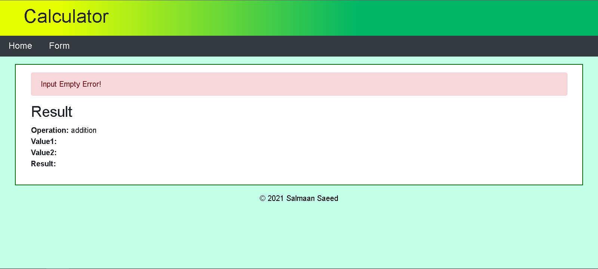

# Flash Messages and Validation

**The web application of the calculator program shows success 
and error flash messages of the calculation. The web application 
uses Flask and Jinja.**

## Flash Messages Output
### Success flash message

### Error flash messages
### Division by Zero

### Input is empty

